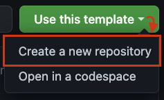

# Serko Exercise: Dionysus

**Welcome to this exercise repository.**

The intention for this exercise is to understand a bit more about how you work as a frontend focussed engineer.

We have designed this exercise to take approximately 2 hours of your time.
If the exercise is not completed in full, feel free to add some notes as a markdown file explaining why and how you would have continued with more time.

## Creating your workspace

We are utilising Github's template repository feature. Please create your own copy of this repository by clicking the **"Use this Template"** button and selecting the **"Create a new repository"** option.



When you are done, please submit the URL to your Github repo back to us.

## Where to start

- Please head over to read the [instructions](INSTRUCTIONS.md)
- Also consider the [context](CONTEXT.md) file we have provided for your notes

## How to get running

### Prerequisites

- Node LTS, we have tested this exercise using version 18.x
- A `.env.local` file containing your `TMDB_AUTH` key. To save time we have provided a `.env.local` in our email containing a TMDB key you can use. Feel free to use your own

### Running code

#### Quick start

```bash
npm install
npm run dev
```

### Further reading

We understand that this might be the first time that you have encountered some of these technologies. Here is a list of links that you may find useful for completing the exercise:

- [NextJS](https://nextjs.org/docs)
- [Material UI](https://mui.com/material-ui/getting-started/)
- [TMDB API](https://developer.themoviedb.org/reference/intro/getting-started)
